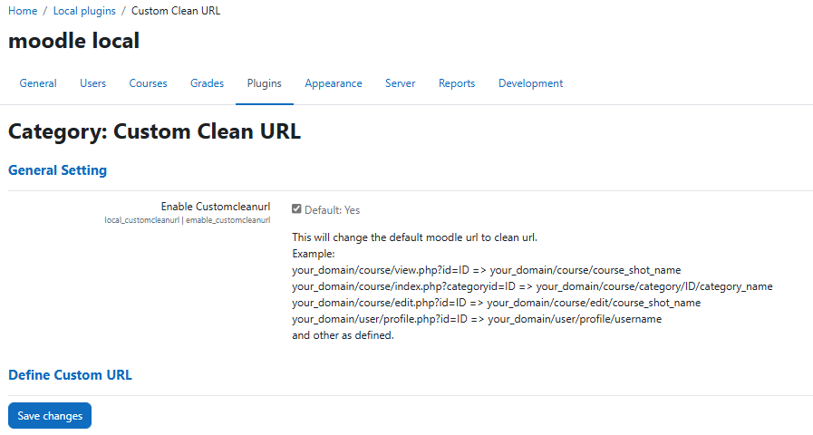
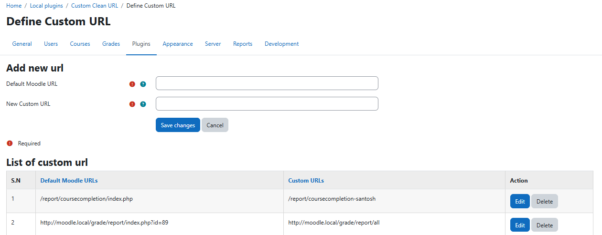

# customcleanurl
customcleanurl main idea is to convert the moodle url in more readable format by removing id parameter

## For Example:
1. Course View Page URL
    your_domain/course/view.php?id=ID => your_domain/course/course_shot_name
2. Course Category Page URL
    your_domain/course/index.php?categoryid=ID => your_domain/course/category/ID/category_name
3. Course Edit Page URL
    your_domain/course/edit.php?id=ID => your_domain/course/edit/course_shot_name
4. User Profile URL
    your_domain/user/profile.php?id=ID => your_domain/user/profile/username
5. Other as defined.

## Installation
You can download as a zip from github then extract into your_moodle/local/customcleanurl/

## Modify Apache .htaccess file
```
# BEGIN_MOODLE_LOCAL_CUSTOMCLEANURL
# DO NOT EDIT route
<IfModule mod_rewrite.c>
# Enable RewriteEngine
RewriteEngine On
# All relative URLs are based from root
RewriteBase /
# Do not change URLs that point to an existing file and directory.
RewriteCond %{REQUEST_FILENAME} !-f
RewriteCond %{REQUEST_FILENAME} !-d
RewriteRule ^(.*)$ /local/customcleanurl/locallib/route.php [L]
ErrorDocument 403 /local/customcleanurl/locallib/404.php
ErrorDocument 404 /local/customcleanurl/locallib/404.php
</IfModule>
# DO NOT EDIT route

# Deny access to hidden files - files that start with a dot (.)
<FilesMatch \"^\.\">
Order allow,deny
Deny from all
</FilesMatch>

# Deny directory view
Options +FollowSymLinks
Options -MultiViews
Options -Indexes

# END_MOODLE_LOCAL_CUSTOMCLEANURL
```

## Screenshot



## Reference : 
1. https://moodledev.io/docs/4.5/apis/core/hooks
2. https://docs.moodle.org/dev/Callbacks 
3. https://phpdoc.moodledev.io/main/d4/dbf/interfacecore_1_1output_1_1url__rewriter.html
4. https://github.com/brendanheywood/moodle-local_cleanurls